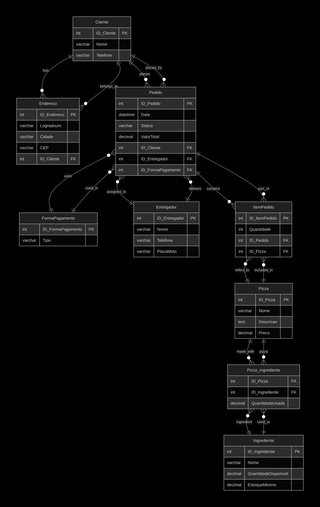

# 🍕 Pizzaria Suprema - Sistema de Gestão de Pedidos (PostgreSQL)

Este projeto demonstra a conclusão das Experiências Práticas de Modelagem e Implementação de Banco de Dados. O sistema modela a gestão completa de uma pizzaria, incluindo clientes, pedidos, estoque de ingredientes e entregadores.

---

## 🎯 Modelo de Dados e Normalização

O Modelo Lógico de Dados foi desenvolvido com foco na **Terceira Forma Normal (3FN)**, garantindo a eliminação de redundâncias e a aplicação rigorosa da Integridade Referencial.

A estrutura de tabelas final está em conformidade com as seguintes regras de normalização:

* **Primeira Forma Normal (1FN):** Todos os dados são atômicos e há uma chave primária definida em cada tabela.
* **Segunda Forma Normal (2FN):** Garantia de que todos os atributos não-chave dependem da chave primária **inteira**, crucial nas tabelas associativas (`ItemPedido`, `Pizza_Ingrediente`).
* **Terceira Forma Normal (3FN):** Eliminação de dependências transitivas, separando entidades como `Endereco` e `FormaPagamento` em tabelas próprias.

## 📊 Estrutura Lógica do Banco de Dados (DER - Notação Crow's Foot)

O diagrama abaixo representa a estrutura de tabelas, chaves primárias (PK) e chaves estrangeiras (FK) que serve de base para o projeto.

---

## 🛠️ Implementação e Scripts SQL

O banco de dados foi implementado em **PostgreSQL**. A execução dos scripts deve ser feita em ordem para garantir a integridade referencial.

| Arquivo | Conteúdo | Objetivo |
| :--- | :--- | :--- |
| `01_ddl_create_tables.sql` | `CREATE TABLE` | Criação da estrutura completa do banco de dados e suas restrições. |
| `02_dml_insert_data.sql` | `INSERT INTO` | População das 8 tabelas com dados de teste para simulação de pedidos. |
| `03_dml_consultas.sql` | `SELECT` com JOINs, WHERE, GROUP BY. | Demonstração da capacidade de extrair informações de negócio (Ex: Top Pizzas, Faturamento). |
| `04_dml_update_delete.sql` | `UPDATE` e `DELETE` com `WHERE`. | Teste de manipulação segura de dados e validação das regras de Integridade Referencial. |

## 🔗 Execução

Para iniciar o ambiente, crie o banco de dados `pizzaria_suprema` no PostgreSQL e execute os scripts DDL e DML em sequência (01, 02).
